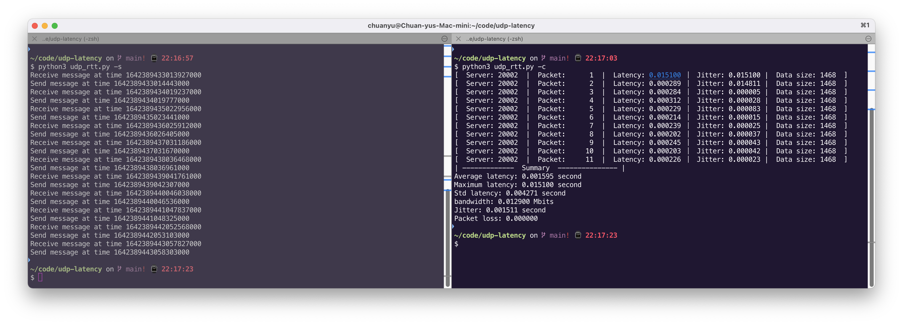
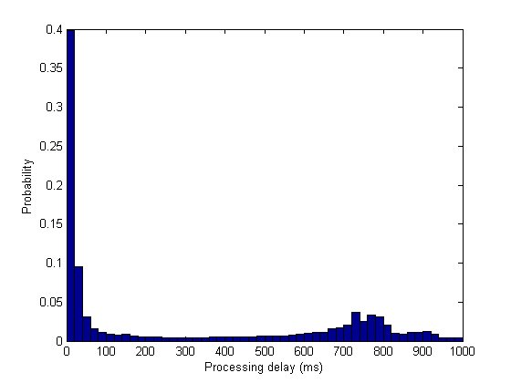

# udp-latency
A tiny end-to-end latency testing tool implemented by UDP protocol in Python 📈. 

- `udp_latency.py` records one way latency.
- `udp_rrt.py` records round-trip latency, which has same arguments as udp_latency.

## Features

Compare with existing communication latency measuring tools.

|                              | [udp-latency](https://github.com/ChuanyuXue/udp-latency) | [tcp-latency](https://github.com/dgzlopes/tcp-latency) | Ping command | [IPerf](https://iperf.fr) |
| ---------------------------- | -------------------------------------------------------- | ------------------------------------------------------ | ------------ | ------------------------- |
| Support UDP                  | ✅                                                        | ❌                                                      | ❌            | ✅                         |
| Flexible packet size         | ✅                                                        | ❌                                                      | ❌            | ❌                         |
| Flexible bandwidth           | ✅                                                        | ❌                                                      | ❌            | ✅                         |
| Specific sending period   | ✅                                                        | ✅                                                      | ✅            | ❌                         |
| Simple as single Python file | ✅                                                        | ❌                                                      | ❌            | ❌                         |

## Server Usage

`python3 udp_latency.py -c -f/m <frequency / bandwidth> -n <packet size> -t <running time> --ip <remote ip> --port <to port> --verbose <bool> --sync <bool>`

## Client Usage

`python3 udp_latency.py -s -b <buffer size> --ip <remote ip> --port <local port> --verbose <bool> --sync <bool> --save <records saving path>`

## Arguments

| Argument  | Description                                                  | Default value |
| --------- | ------------------------------------------------------------ | ------------- |
| -c        | Client                                                       | N/A           |
| -s        | Server                                                       | N/A           |
| -f        | Frequency of sending packets from clients, unit is Hz (number of packet per second). -f “m” means constantly send UDP packets in maximum bandwidth | 1             |
| -m        | Bandwidth of sending packets from clients, unit is Mbits. This argument will overwritten -f argument. | N/A           |
| -n        | Size of sending packets in clients, unit is bytes. Notes that it is the frame size on wire including IP header and UDP header, the packet size should be within \(44, 1500\]. | 1500          |
| -t        | Client running time, uint is second. The server also stops when client stops running. | 10            |
| -b        | Buffer size in server.                                       | 1500          |
| --ip      | Remote ip.                                                   | 127.0.0.1     |
| --port    | To port and local port for client and server respectively.   | 20001         |
| --verbose | Whether to print the testing result each iteration.          | True          |
| --sync    | Whether to do the time synchronization in advance.  (only for udp_latency.py) | True          |
| --dyna    | Whether to use dynamic bandwidth adaption.                   | True          |
| --save    | File path to save testing result.                            | ./result.csv  |

## Time synchronization (--sync)

⚠️ Udp-latency requires the precise synchronization (same clock time) between server and clients. The basic idea for built-in function is from [IEEE PTP](https://en.wikipedia.org/wiki/Precision_Time_Protocol) protocol.

In the first 10 seconds before latency test, PTP events are exchanged per second to calculate **time offset** between server and clients. To aviod the impact on the experimental traffic, udp-latency stops sending PTP message during experiment and neglecting the time drifting.

Udp-rrt doesn't rely on synchronization.

## Dynamic adaption (--dyna)

⚠️  This method will slightly damage the periodicity. (Small jitter contains with this additional bandwidth optimization)

Due to the processing delay is non-deterministic on normal operation systems as following figure, it is possible that the sending frequency is significantly slower than the expectation.

>> For example, you with to send flow in 5Mbits by `-m` paramter (for a 100 byte packet in 1 Gbs linkspeed, you call `socket.sendto` every 2.5 us in Python interpreter), however the sending speed can be only 3Mbits during runtime as there is a uncontrollable delay in `socket.sendto()` code (so actually the OS call udp send around every 4.2 us). This is a common issue for a non-realtime OS when the application layer and MAC layer are not synchronized especial for high-frequency traffic. If your application is time critical, I would suggest you to try Linux Qdisc ETF scheduler with LaunchTime function with Intel i210 NIC, which is the best solution I know so far :)

To alleviate this problem here, this code introduces a dynamic adaption approach to achieve expected bandwidth:

$$
NewFrequency = \frac{ExpectedFrequency}{DecayedRate}, ExpectedFrequency = \frac{CurrentFrquency \times RunningTime}{RemaingTime}, DecayedRate = \frac{CurrentFrequency}{Global Frequency}
$$

Where $CurrenctFrequency$ is the average frequency from program beginning to current time. $GlobalFrequency$ is the frequency user set with `-f` or `-m` argument. $RunningTime$ and $RemainingTime$ is the time from programming beginning time and time to programming ending time defined by `-t` argument respectively.

Due to locally test through `127.0.0.1` the gap between realistic and expected bandwidth is bounded within 1%, the difference can be 30% without dynamic adaption.

## Contact

Feel free to contact me at chuanyu.xue@uconn.edu
